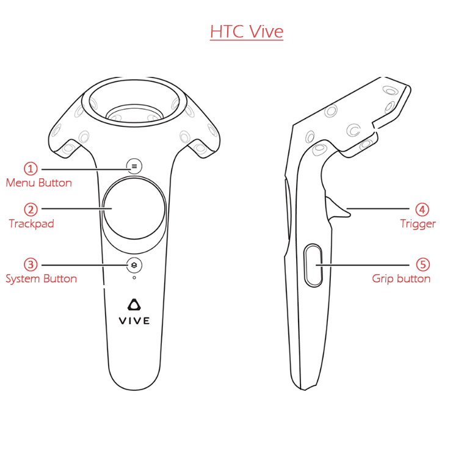
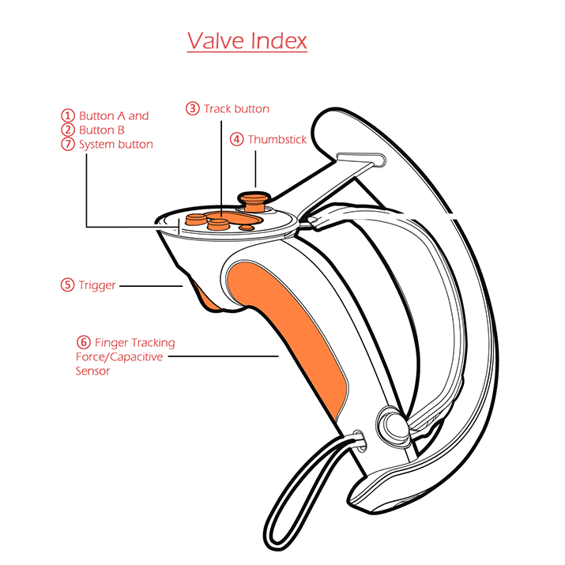

# Leap Motion Controller Emulation - SteamVR Driver
[](https://ci.appveyor.com/project/SDraw/driver-leap) [](../../releases/latest)

A Fork with updated vendor libraries and extended features.

[](https://www.youtube.com/playlist?list=PLiEPsxTlqsDk5GKcgsmeDQNRs7KV8lI-s)

### Contents
* [Installation (for users)](#installation)
* [Driver Control configuration and Inputs](#driver-control-configuration-and-inputs)
* [Controller emulation](#controller-emulation)
  * [HTC Vive](#htc-vive)
  * [Valve Index](#valve-index)
* [Troubleshooting](#troubleshooting)
* [Building (for developers)](#building)

## Installation 
*for users*

* Install [latest Leap Motion Orion Beta](https://developer.leapmotion.com/get-started)
* **Method #1:** *recommended*
  * You should already have Steam and SteamVR installed.
  * Create 'leap' folder in '<SteamVR_folder>/drivers' 
    `(Default: C:\Program Files (x86)\Steam\steamapps\common\SteamVR\drivers)`
  * Grab [latest release archive](../../releases/latest) (.zip) for your platform
  * Extract archive to '<SteamVR_folder>/drivers/leap' 
    `(Default: C:\Program Files (x86)\Steam\steamapps\common\SteamVR\drivers\leap)`
  * Edit steamvr configuration in '<Steam_folder>/config/steamvr.vrsettings' file 
    `(Default: C:\Program Files (x86)\Steam\config)`
    * If you are **using a HMD** already,
      * Add below line in section 'steamvr'
      ```JSON
      "activateMultipleDrivers": true,
      ```
    * If you want to try **without HMD**,
      * Add following lines in 'steamvr' section, and
      ```JSON
      "activateMultipleDrivers": true,
      "requireHmd" : false,
      "forcedDriver" : "null"
      ```
      * Add another section 'driver_null', if it dosen't exist already (you can change renderHeight/Width and windowHeight/Width below)
      ```JSON
      "driver_null" : {
        "displayFrequency" : 60,
        "enable" : true,
        "modelNumber" : "Null Model Number",
        "renderHeight" : 1080,
        "renderWidth" : 1920,
        "secondsFromVsyncToPhotons" : 0.01111111,
        "serialNumber" : "Null Serial Number",
        "windowHeight" : 1080,
        "windowWidth" : 1920,
        "windowX" : 0,
        "windowY" : 0
      }
      ```    
* **Method #2:**
  * Install [base project driver](https://github.com/cbuchner1/driver_leap/releases/tag/alpha8)
  * Grab [latest release archive](../../releases/latest) for your platform
  * Extract archive to '<base_project_installation_folder>/leap'

## Driver Control configuration and Inputs
Driver can emulate HTC Vive controllers and Valve Index controllers with skeletal animation. Works in both desktop and HMD orientations of leap controller. Which controller to emulate and in what orientation leap controller is being used in, can be adjusted by editing `settings.xml` in 'resources' folder. 
`(Default: C:\Program Files (x86)\Steam\steamapps\common\SteamVR\drivers\leap\resources)`

There are more configurable restrictions, such as global input, trackpad, trigger, grip and etc. in `settings.xml`. Check [wiki page](../../wiki/Offset-settings) for few offset settings contributed by users.
Controls are changed by "Game Profiles" that are enabled automatically when respective game is started from Steam.

Available Hotkeys in NumLock active state:
* **Ctrl-P:** Enable/disable right hand controller.
* **Ctrl-O:** Enable/disable left hand controller.
* **Ctrl-§/Ctrl-|*\\*\:** Reload configuration.

## Controller Emulation
Real VR controllers give button touches, button presses, hand orientation feedbacks to SteamVR, which are then relayed to Game applications for different actions in-game. This driver emulates such feedback via gesture recognition by Leap motion controller and provides it to SteamVR. Preconfigured gestures are specified below for respective controller types and game profiles.

### HTC Vive


Game profiles:
  * **default**  
  Controls list:
    * Application menu - hand with palm directed towards face    
    * Touchpad
      - Touchpad press - thumb press
      - Touchpad circle - index finger of one hand directed towards other hand's palm
    * System menu - T-shape with two hands
    * Trigger - bending of the index finger
    * Grip - grab gesture
  * **vrchat** - profile for VRChat. Control restrictions are ignored.  
  Controls list:
    * Gun - corresponding hand gesture
    * V-shape - corresponding hand gesture
    * Point - corresponding hand gesture
    * Rock out - corresponding hand gesture
    * Thumbs up - corresponding hand gesture
    * Spread hand - corresponding hand gesture. Also corresponds to grip button.
    * Trigger - grab gesture
    * Application menu - T-shape with two hands
    
### Valve Index 


Game profiles:
  * **default**  
  Controls list:  
    * Button A - touching of thumb and middle fingertips
    * Button B - touching of thumb and pinky fingertips
    * Touchpad
      - Touchpad - thumb press
      - Touchpad cycle - index finger of one hand directed towards other hand's palm
    * Thumbstick
      - Thumbstick press - touching of thumb fingertip of one hand to index fingertip of other hand
      - Thumbstick direction - arrow keys for left hand, Num2/8/4/6 keys for right hand; available when NumLock is active    
    * Trigger - bending of the index finger
    * Grip - bending of middle, ring and pinky fingers
    * System button - T-shape with two hands
  * **vrchat** - profile for VRChat. Note: game gestures are not implemented due to finger tracking, grip input profile should be used.  
  Controls list:
    * Trigger - bending of the index finger
    * Grip - grab gesture
    * Game menu - T-shape with two hands

## Troubleshooting
Sometimes installation of [base project driver](https://github.com/cbuchner1/driver_leap) doesn't register driver folder for SteamVR. To manually add it:
  * Open console as administrator in '<SteamVR_folder>/bin/[win32 or win64]' 
    `(Default: C:\Program Files (x86)\Steam\steamapps\common\SteamVR\bin\[win32 or win64])` 
    and execute command:
    ```
    vrpathreg adddriver "path_to_leap_folder"
    ```
    With default leap folder path, the command should look something like:
    ```
    vrpathreg adddriver "C:\Program Files (x86)\Steam\steamapps\common\SteamVR\drivers\leap"
    ```
  * Check if driver folder is added by calling `vrpathreg` without any arguments.
  * Open '<Steam_folder>/config/steamvr.vrsettings' file and add line in 'steamvr' section:
    ```JSON
    "activateMultipleDrivers": true,
    ```
  * You can also check if the driver emulated controllers are registered with SteamVR by using the command `vrcmd` in the same 'bin' folder as above.

## Building 
*for developers*

* Open 'driver_leap.sln' solution in **Visual Studio 2013** (Other versions of Visual Studio have to build their own vendor libraries using CMake and retarget solution)
* Build the solution as per your platform. Output files for:
  * x64 - in 'bin/win64', in solution folder.
  * x86 - in 'bin/win32', in solution folder.
* Copy the following built files to 'leap/bin/<your_platform>': 
  `(Default: C:\Program Files (x86)\Steam\steamapps\common\SteamVR\drivers\leap\bin\[win64 or win32])`
  * driver_leap.dll
  * gesture_checker.exe
  * leap_monitor.exe  
**Note:** There are post-build events for projects to copy build files directly to SteamVR driver folder that can be enabled manually.
* Copy additional shared vendor libraries from solution folder to 'leap/bin/<your_platform>': 
  `(Default: C:\Program Files (x86)\Steam\steamapps\common\SteamVR\drivers\leap\bin\[win64 or win32])`
  * vendor/LeapSDK/bin/<your_platform>/LeapC.dll
  * vendor/openvr/bin/<your_platform>/openvr_api.dll
* Copy 'resources' folder from solution root to driver's 'leap' folder. 
  `(Default: C:\Program Files (x86)\Steam\steamapps\common\SteamVR\drivers\leap\resources)`
* For runtime debugging and breakpointing attach MSVS debugger to `vrserver.exe` process.
  
